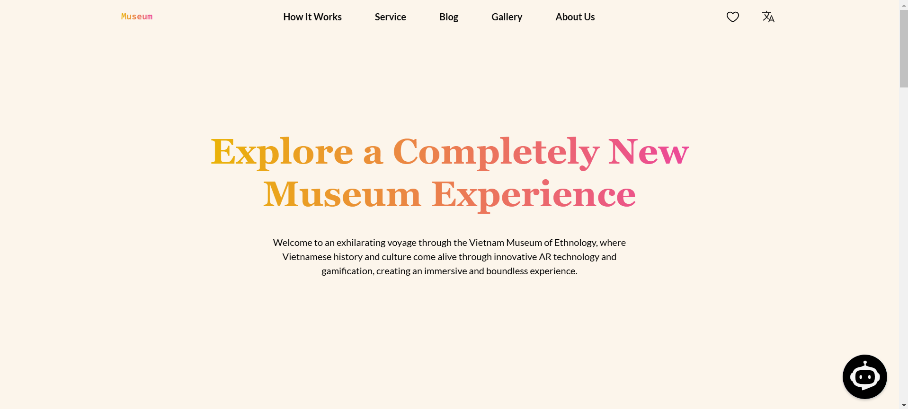

# Museum Chatbot Web App 🌐🏛️  

A multilingual, AI-powered chatbot for booking museum tickets and enhancing user experiences. Built using **Django** for the backend and **React** for the frontend, this application integrates secure payments via Razorpay, enables artifact knowledge retrieval via image uploads, and ensures accessibility and inclusivity for all users.  

---

## Features ✨  

### 1. **Multilingual Support** 🌏 
- The chatbot supports multiple languages, making the museum accessible to a diverse, global audience.  
- Users can interact in their preferred language, breaking down communication barriers and fostering inclusivity.  

---

### 2. **Seamless Ticketing** 🎟️  
- Visitors can book museum tickets through the chatbot, skipping long queues.  
- Integrated with **Razorpay** for secure payments.  
- Provides real-time updates, instant booking confirmation, QR codes for entry, and notifications about upcoming events.  

---

### 3. **Interactive Artifact Information** 📷  
- Users can upload images of artifacts or type queries to receive detailed information, historical context, and fascinating anecdotes about the exhibits.  
- This feature encourages deeper engagement and enriches the learning experience for visitors.  

---

### 4. **24/7 Accessibility** 🕒  
- The chatbot is accessible across websites, mobile apps, and social media platforms.  
- Users can explore museum offerings, book tickets, and get assistance at their convenience.  
- Designed to cater to users with unique scheduling needs and disabilities.  

---

## Tech Stack 🛠️  

### Frontend  
- **React.js**  
- **TailwindCSS**  

### Backend  
- **Django**  
- **Django Rest Framework**  


### Payment Gateway  
- **Razorpay Integration**  

### Email Service
- **Sendgrid Integration**
---

## Installation and Setup 🚀  

1. Clone the repository:  
   ```bash
   git clone https://github.com/yourusername/museum-chatbot.git
   cd museum-chatbot
   ```  

2. **Backend Setup** (Django):  
   - Install dependencies:  
     ```bash
     pip install -r requirements.txt
     ```  
   - Run database migrations:  
     ```bash
     python manage.py migrate
     ```  
   - Start the server:  
     ```bash
     python manage.py runserver
     ```  

3. **Frontend Setup** (React):  
   - Navigate to the `frontend` folder:  
     ```bash
     cd frontend
     ```  
   - Install dependencies:  
     ```bash
     npm install
     ```  
   - Start the development server:  
     ```bash
     npm start
     ```  

4. Visit the application:  
   Open [http://localhost:3000](http://localhost:3000) in your browser for the frontend and [http://localhost:8000](http://localhost:8000) for the backend.  

---

## Usage Guide 💡  

1. **Chatbot Interaction**:  
   - Use the chatbot to book tickets, get museum updates, or ask questions about artifacts.  
   - Upload an image of an artifact to learn more about it.  

2. **Ticket Booking**:  
   - Visitors can book museum tickets directly through the chatbot, skipping long queues.
   - Integrated with Razorpay for secure payments.
   - Download tickets as a PDF, which is also sent to users via SendGrid email integration.


3. **Multilingual Access**:  
   - Switch languages to interact with the chatbot in your preferred language.  

---

## Screenshots 📸  
### Home Page  
  

### Chatbot Interaction  
  

---

## Contributing 🤝 
Contributions are welcome! Follow these steps to contribute:  

1. Fork the repository.  
2. Create a new branch:  
   ```bash
   git checkout -b feature-name
   ```  
3. Make your changes and commit them:  
   ```bash
   git commit -m "Added new feature"
   ```  
4. Push to the branch:  
   ```bash
   git push origin feature-name
   ```  
5. Open a pull request on GitHub.  

---

## License 📄  
This project is licensed under the MIT License. See the [LICENSE](LICENSE) file for details.  

---

## Contact 📧  
For any queries or suggestions:  
- **Portfolio**: [amareshh.vercel.app](https://amareshh.vercel.app/)  

---

**Enjoy exploring the museum with our chatbot!** 🎉
